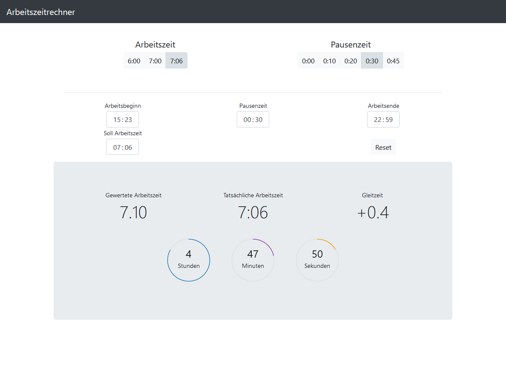

# Arbeitszeitrechner #

Eine einfache Anwendung, bei der man den Arbeitsbeginn einträgt und automatisch der Feierabendbeginn ausgerechnet wird.

Diese Anwendung wurde von einer Anderen inspiriert, aber eigenständig erweitert/verändert.
Hier geht es zum [Original.](https://github.com/iC0RE/arbeitszeitrechner)

## Upcomming Features

- Gewünschte Gleitzeit eingeben und das Arbeitsende wird berechnet (v2.2)
- Automatische Pausenzeiterfassung (v.2.3)

## Versions

- [aktulle Version](https://raw.githack.com/LukasDano/arbeitszeitrechner/main/index.html)
- [v2.1.01](https://rawcdn.githack.com/LukasDano/arbeitszeitrechner/48ed6cf98b3c04545e984ede487dfdddb15b022a/index.html)
- [v2.1](https://rawcdn.githack.com/LukasDano/arbeitszeitrechner/ed061c80ee0986b4d37021bf1e1dfe7c76e633bf/index.html)
- [v1.0](https://rawcdn.githack.com/LukasDano/arbeitszeitrechner/0eb78712aac0fa3f846ca71cf650d0df1f2e7175/index.html)

## Vorschau

