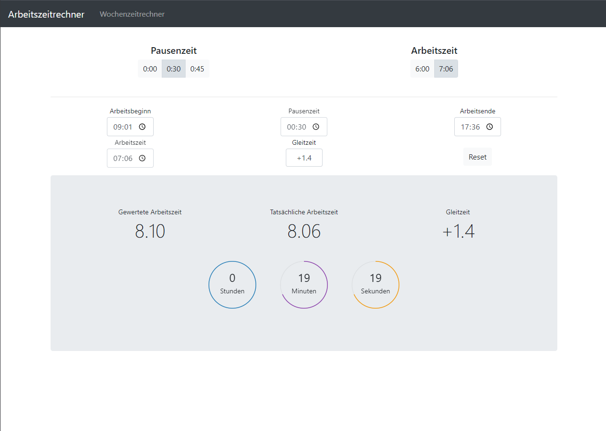

# Arbeitszeitrechner #

Eine einfache Anwendung, bei der man den Arbeitsbeginn einträgt und automatisch der Feierabendbeginn ausgerechnet wird.
Jetzt einfach die [aktuelle Version](https://raw.githack.com/LukasDano/arbeitszeitrechner/main/index.html) ausprobieren.
Hier kann man die aktuelle [Testversion](https://raw.githack.com/LukasDano/arbeitszeitrechner/bugfix/index.html) einsehen.

Diese Anwendung wurde von einer Anderen inspiriert, aber eigenständig erweitert/verändert.
Hier geht es zum [Original.](https://github.com/iC0RE/arbeitszeitrechner)

Über dieses [Tool](https://raw.githack.com/) kann man die HTML-Datei direkt auf GitHub abrufen und darstellen.
Hier gehts zum [Repository](https://github.com/neoascetic/rawgithack) des Tools.

## old versions

- [v2.5](https://rawcdn.githack.com/LukasDano/arbeitszeitrechner/58747161d2dcae43b8328df155c2be62cb692872/index.html)
- [v2.2.02](https://rawcdn.githack.com/LukasDano/arbeitszeitrechner/1c4db626814297964dcc7d3a983e996029d80468/index.html)
- [v2.1.03](https://rawcdn.githack.com/LukasDano/arbeitszeitrechner/d42c883503d5d91299906f788e7a74936b340537/index.html)
- [v1.0](https://rawcdn.githack.com/LukasDano/arbeitszeitrechner/0eb78712aac0fa3f846ca71cf650d0df1f2e7175/index.html)

## Vorschau

