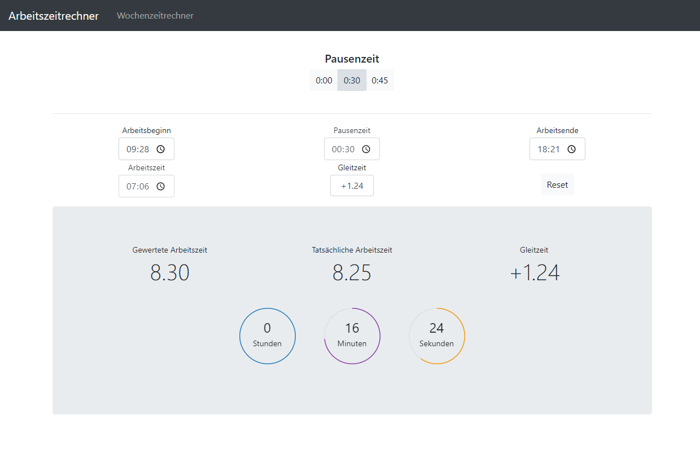

# Arbeitszeitrechner #

Eine einfache Anwendung, bei der man den Arbeitsbeginn einträgt und automatisch der Feierabendbeginn ausgerechnet wird.

Diese Anwendung wurde von einer Anderen inspiriert, aber eigenständig erweitert/verändert.
Hier geht es zum [Original.](https://github.com/iC0RE/arbeitszeitrechner)

## Upcomming

- Gewünschte Gleitzeit eingeben und das Arbeitsende wird berechnet
- Automatische Pausenzeiterfassung
- Bessere Darstellung der Wochenzeit

## Versions

- [aktulle Version](https://raw.githack.com/LukasDano/arbeitszeitrechner/main/index.html)
- [v2.2.01](https://rawcdn.githack.com/LukasDano/arbeitszeitrechner/ff12d783c13e44b0ee4b57731deb8b62c58989dc/index.html)
- [v2.1.03](https://rawcdn.githack.com/LukasDano/arbeitszeitrechner/d42c883503d5d91299906f788e7a74936b340537/index.html)
- [v1.0](https://rawcdn.githack.com/LukasDano/arbeitszeitrechner/0eb78712aac0fa3f846ca71cf650d0df1f2e7175/index.html)

## Vorschau

